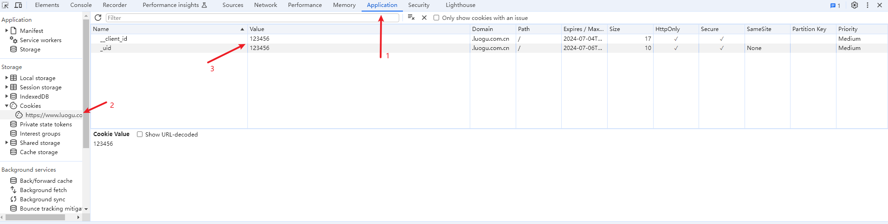

# Remote Judge
You can add `-r` or `--remote` flag to submit your program to online judge platform.

> [!NOTE]
> This feature is currently supported only on the `luogu` platform. 

## Usage

### Get uid and client_id
They can be found in your browser cookies after logging in to `luogu`.

This is an example of how to use chrome to find them.

1. Logging in to `luogu`.
2. Then, press `F12` to open the `DevTools`.
3. You will find two cookies in the `application` tab.



### Set environment variable

You need to set two environment variables that named `_uid` and `__client_id`. The value of them are your cookies value.

#### Linux
In Linux, you can execute the following commands.
```bash
export _uid=<your uid value>
export __client_id=<your client_id value>
```

#### Windows
In Windows, you can add variables via the System Properties.

### Add OiRunner flag
Add `-r <luogu question id>` or `--remote <luogu question id>` to submit to `luogu`.

For example:
```bash
oirun 1 -r P1001
```
This command will submit `1.cpp` to `P1001` question on `luogu`.

## Copyright
We respect the copyright of other Online Judges' questions. We don't provide judge services. Users use OiRunner to submit questions just like they do the same in browser.